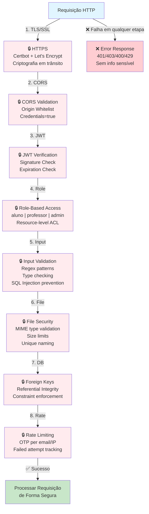
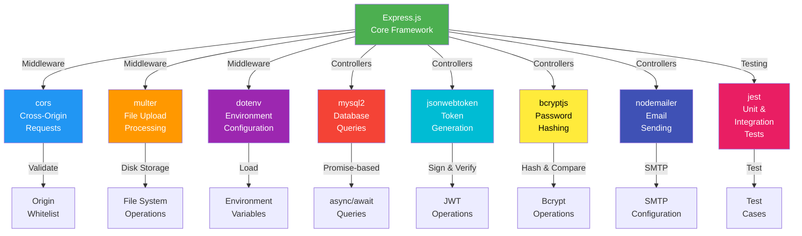
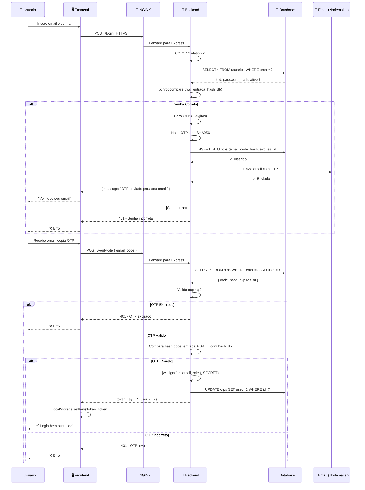

# Diagrama de Arquitetura - Ferramentas e Funções

## Diagrama Completo da API

```mermaid
graph TB
    subgraph Client["🖥️ CLIENTE (Frontend Next.js)"]
        React["React Components"]
        AuthCtx["AuthProvider Context"]
        ApiLib["API Client<br/>lib/api.js"]
    end

    subgraph Network["🌐 REDE"]
        HTTPS["HTTPS/TLS<br/>Certbot+Nginx"]
    end

    subgraph Nginx["🔗 NGINX (Reverse Proxy)"]
        NginxConf["nginx.prod.conf"]
        SSL["SSL/TLS Termination"]
        Cache["Cache Assets"]
        BalanceReq["Load Balancing"]
    end

    subgraph Backend["🚀 BACKEND EXPRESS (Node.js)"]
        subgraph Router["📍 ROUTER (router.js)"]
            AuthRoutes["Auth Routes<br/>POST /login<br/>POST /register<br/>POST /verify-otp"]
            DataRoutes["Data Routes<br/>GET /select*<br/>POST /insert*<br/>PUT /update*<br/>DELETE /delete*"]
            ReportRoutes["Report Routes<br/>GET /relatorio*<br/>GET /relatorios"]
        end

        subgraph Middleware["🔒 MIDDLEWARES"]
            CorsMidd["CORS Middleware<br/>- Origin Whitelist<br/>- Credentials<br/>- Headers"]
            AuthMidd["Authentication<br/>- JWT Verify<br/>- Token Decode<br/>- Role Check"]
            ApiKeyMidd["API Key Auth<br/>- x-api-key Validation<br/>- URL param check"]
            UploadMidd["Upload Middleware<br/>Multer<br/>- MIME Validation<br/>- Size Limit<br/>- File Naming"]
            ValidationMidd["Validation Middleware<br/>- Business Rules<br/>- Input Sanitize<br/>- Data Type Check"]
            PaginationMidd["Pagination<br/>- Limit<br/>- Offset<br/>- Sort"]
        end

        subgraph Controllers["🎮 CONTROLLERS"]
            CtAuth["CT_auth.js<br/>- loginController<br/>- registerController<br/>- verifyController<br/>- refreshRoleController<br/>- resetPasswordController"]
            CtOtp["CT_otp.js<br/>- sendOtpController<br/>- verifyOtpController<br/>- resendOtpController"]
            CtSelect["CT_select.js<br/>- getAlunos<br/>- getProfessores<br/>- getProjetosController<br/>- getRegistrosController<br/>- getArquivosController"]
            CtInsert["CT_insert.js<br/>- inserirAluno<br/>- inserirProfessor<br/>- inserirProjeto<br/>- inserirRegistro<br/>- inserirArquivo<br/>- inserirCusto"]
            CtUpdate["CT_update.js<br/>- atualizarProjeto<br/>- atualizarRegistro<br/>- atualizarRelatorio<br/>- atualizarCustos"]
            CtDelete["CT_delete.js<br/>- deletarProjeto<br/>- deletarRegistro<br/>- deletarArquivo<br/>- deletarCusto"]
            CtUserProj["CT_usuario_projeto.js<br/>- addUserToProject<br/>- removeUserFromProject<br/>- getUserProjects"]
        end

        subgraph Models["📊 MODELS (Camada de Dados)"]
            ModelAlunos["alunos.js"]
            ModelProfessores["professores.js"]
            ModelProjetos["projetos.js"]
            ModelRegistros["registros.js"]
            ModelArquivos["arquivos.js"]
            ModelCustos["custos.js"]
            ModelUsuarios["usuarios.js"]
            ModelTurmas["turmas.js"]
            ModelCursos["cursos.js"]
            ModelAreas["areas_academicas.js"]
        end

        subgraph Auth["🔐 AUTENTICAÇÃO"]
            JwtSign["JWT Sign<br/>jsonwebtoken<br/>- Payload Encode<br/>- Secret Key<br/>- Expiration"]
            JwtVerify["JWT Verify<br/>- Token Validation<br/>- Signature Check<br/>- Expiration Check"]
            BcryptHash["Bcrypt Hash<br/>- Password Hash (10 rounds)<br/>- Salt Generation"]
            BcryptComp["Bcrypt Compare<br/>- Hash Verification<br/>- Constant Time"]
            CryptoHash["Crypto Hash<br/>- OTP Hashing<br/>- SHA256 Algorithm"]
        end

        subgraph Email["📧 EMAIL & OTP"]
            Nodemailer["Nodemailer<br/>- SMTP Connection<br/>- Email Sending<br/>- HTML Templates"]
            OtpGen["OTP Generation<br/>- Random Code<br/>- Hash Storage<br/>- TTL Management"]
            RateLimit["Rate Limiting<br/>- Per Email Limit<br/>- Per IP Limit<br/>- Failed Attempts"]
        end

        subgraph Validation["✅ VALIDAÇÃO"]
            ValidRegex["Regex Validation<br/>- Email Pattern<br/>- Phone Format<br/>- Matricula Length"]
            ValidFK["Foreign Key Check<br/>- usuario_id exists<br/>- curso_id exists<br/>- projeto_id exists"]
            ValidBusiness["Business Rules<br/>- Unique Matricula<br/>- Valid Codes<br/>- Status Checks"]
        end

        subgraph Database["🗄️ DATABASE LAYER"]
            DbConnection["MySQL2 Connection<br/>conectaraoDB.js<br/>- Connection Pool<br/>- Prepared Statements<br/>- Promise Support"]
        end
    end

    subgraph DB["💾 DATABASE (MySQL)"]
        Usuarios["usuarios<br/>├─ id (PK)<br/>├─ email (UNIQUE)<br/>├─ password (hashed)<br/>└─ ativo (BOOLEAN)"]
        Alunos["alunos<br/>├─ id (PK)<br/>├─ usuario_id (FK)<br/>├─ id_curso (FK)<br/>└─ matricula (UNIQUE)"]
        Professores["professores<br/>├─ id (PK)<br/>├─ usuario_id (FK)<br/>├─ id_area (FK)<br/>└─ matricula (UNIQUE)"]
        Projetos["projetos<br/>├─ id (PK)<br/>├─ orientador (FK)<br/>├─ tipo_projeto<br/>└─ published"]
        Registros["registros<br/>├─ id (PK)<br/>├─ id_projeto (FK)<br/>├─ data_reuniao<br/>└─ relatorio"]
        Arquivos["arquivos<br/>├─ id (PK)<br/>├─ id_projeto (FK)<br/>├─ caminho<br/>└─ tipo_arquivo"]
        Custos["custos<br/>├─ id (PK)<br/>├─ id_projeto (FK)<br/>├─ descricao<br/>└─ valor"]
        OtpsTable["otps<br/>├─ id (PK)<br/>├─ email<br/>├─ code (hashed)<br/>└─ expires_at"]
        Areas["areas_academicas<br/>├─ id (PK)<br/>├─ codigo_area<br/>└─ nome_area"]
        Cursos["cursos<br/>├─ id (PK)<br/>├─ nome_curso<br/>└─ coordenador"]
        Turmas["turmas<br/>├─ id (PK)<br/>├─ cod_turma<br/>└─ id_curso (FK)"]
    end

    subgraph FileSystem["📁 SISTEMA DE ARQUIVOS"]
        Uploads["uploads/<br/>└─ arquivo-timestamp.ext"]
    end

    subgraph Libraries["📚 BIBLIOTECAS EXTERNAS"]
        ExpressLib["Express 5.1.0<br/>Framework HTTP"]
        MysqlLib["MySQL2 3.14.1<br/>Driver SQL"]
        JwtLib["jsonwebtoken 9.0.2<br/>JWT Generation"]
        BcryptLib["bcryptjs 3.0.3<br/>Password Hashing"]
        MulterLib["Multer 1.4.5<br/>File Upload"]
        NodemailerLib["Nodemailer 6.9.4<br/>Email Service"]
        CorsLib["CORS 2.8.5<br/>Cross-Origin"]
        DotenvLib["dotenv 16.5.0<br/>Environment Vars"]
    end

    subgraph Testing["🧪 TESTING"]
        Jest["Jest 29.6.1<br/>Test Framework<br/>- Unit Tests<br/>- Integration Tests"]
    end

    %% Conexões Cliente
    Client -->|HTTP/HTTPS| HTTPS
    React --> ApiLib
    AuthCtx --> ApiLib
    
    %% Conexões HTTPS
    HTTPS -->|TLS Handshake| Nginx
    
    %% Conexões Nginx
    Nginx --> NginxConf
    Nginx --> SSL
    Nginx --> Cache
    Nginx --> BalanceReq
    NginxConf -->|Route to Backend| Backend
    
    %% Conexões Router
    AuthRoutes --> CorsMidd
    DataRoutes --> CorsMidd
    ReportRoutes --> CorsMidd
    
    %% Conexões Middlewares
    CorsMidd --> AuthMidd
    CorsMidd --> ApiKeyMidd
    AuthMidd --> UploadMidd
    UploadMidd --> ValidationMidd
    ValidationMidd --> PaginationMidd
    
    %% Conexões Controllers
    PaginationMidd -->|Auth Requests| CtAuth
    PaginationMidd -->|OTP Requests| CtOtp
    PaginationMidd -->|Select Requests| CtSelect
    PaginationMidd -->|Insert Requests| CtInsert
    PaginationMidd -->|Update Requests| CtUpdate
    PaginationMidd -->|Delete Requests| CtDelete
    PaginationMidd -->|User-Project| CtUserProj
    
    %% Controllers usam Autenticação
    CtAuth --> JwtSign
    CtAuth --> BcryptHash
    CtAuth --> JwtVerify
    CtOtp --> OtpGen
    CtOtp --> JwtSign
    CtOtp --> CryptoHash
    
    %% Controllers usam Email
    CtAuth --> Nodemailer
    CtOtp --> Nodemailer
    CtOtp --> RateLimit
    
    %% Controllers usam Models
    CtAuth --> ModelUsuarios
    CtAuth --> ModelAlunos
    CtAuth --> ModelProfessores
    CtInsert --> ModelProjetos
    CtInsert --> ModelRegistros
    CtInsert --> ModelArquivos
    CtInsert --> ModelCustos
    CtSelect --> ModelProjetos
    CtSelect --> ModelRegistros
    CtSelect --> ModelArquivos
    CtUpdate --> ModelProjetos
    CtUpdate --> ModelRegistros
    CtDelete --> ModelProjetos
    CtDelete --> ModelRegistros
    CtUserProj --> ModelAlunos
    CtUserProj --> ModelProfessores
    
    %% Validação
    CtInsert --> ValidRegex
    CtInsert --> ValidFK
    CtInsert --> ValidBusiness
    CtUpdate --> ValidRegex
    CtUpdate --> ValidFK
    
    %% Models para Database
    ModelUsuarios --> DbConnection
    ModelAlunos --> DbConnection
    ModelProfessores --> DbConnection
    ModelProjetos --> DbConnection
    ModelRegistros --> DbConnection
    ModelArquivos --> DbConnection
    ModelCustos --> DbConnection
    ModelTurmas --> DbConnection
    ModelCursos --> DbConnection
    ModelAreas --> DbConnection
    
    %% Database Connection para Tabelas
    DbConnection --> Usuarios
    DbConnection --> Alunos
    DbConnection --> Professores
    DbConnection --> Projetos
    DbConnection --> Registros
    DbConnection --> Arquivos
    DbConnection --> Custos
    DbConnection --> OtpsTable
    DbConnection --> Areas
    DbConnection --> Cursos
    DbConnection --> Turmas
    
    %% Upload Middleware para FileSystem
    UploadMidd --> Uploads
    CtInsert --> Uploads
    
    %% Conexões de Bibliotecas
    Backend -.->|Uses| ExpressLib
    Backend -.->|Uses| MysqlLib
    Backend -.->|Uses| JwtLib
    Backend -.->|Uses| BcryptLib
    Backend -.->|Uses| MulterLib
    Backend -.->|Uses| NodemailerLib
    Backend -.->|Uses| CorsLib
    Backend -.->|Uses| DotenvLib
    Backend -.->|Uses| Jest
```



---

## 📋 Matriz de Componentes e Funções

| Componente | Função | Entrada | Saída | Exemplo |
|-----------|--------|---------|-------|---------|
| **Express** | Framework HTTP | Requisições HTTP | Respostas JSON | `POST /login` |
| **JWT** | Autenticação Token | `{ userId, role }` | Token válido por 24h | `eyJhbGciOiJIUzI1NiIs...` |
| **bcryptjs** | Hash de Senhas | Senha texto plano | Hash com salt | `$2a$10$8e...hC` |
| **Multer** | Upload de Arquivos | `multipart/form-data` | Arquivo salvo + metadata | `/uploads/doc-1704067200000.pdf` |
| **Nodemailer** | Envio de Emails | SMTP Config + Template | Email enviado | OTP: 123456 |
| **MySQL2** | Banco de Dados | Query SQL | Rows/Results | `SELECT * FROM usuarios` |
| **CORS** | Controle de Origem | Origin Header | Allow/Deny | `Access-Control-Allow-Origin` |
| **dotenv** | Variáveis de Ambiente | `.env` file | `process.env.*` | `JWT_SECRET=abc123` |
| **Crypto** | Hashing de OTP | Código + Salt | Hash SHA256 | `abc123...hashed` |
| **Pagination** | Limite/Offset | `?limit=10&offset=0` | Array paginado | Registros 0-10 |

---

## 🔄 Fluxo de Dados Completo


---

## 🛡️ Stack de Segurança



---

## 🔌 Integração de Bibliotecas



---

## 📊 Fluxo de Autenticação (Detalhado)



---

## 📁 Estrutura de Pastas e Responsabilidades

```
backend2/
├── src/
│   ├── app.js                 # Configuração Express + CORS
│   ├── server.js              # Inicialização do servidor
│   ├── router.js              # Definição de rotas
│   │
│   ├── autenticacao/
│   │   └── auth.js            # JWT generation/verification
│   │
│   ├── controles/             # Controllers (lógica de negócio)
│   │   ├── CT_auth.js         # Login, register, OTP verify
│   │   ├── CT_otp.js          # Send OTP, resend, verify
│   │   ├── CT_select.js       # SELECT queries (GET)
│   │   ├── CT_insert.js       # INSERT queries (POST)
│   │   ├── CT_update.js       # UPDATE queries (PUT)
│   │   ├── CT_delete.js       # DELETE queries (DELETE)
│   │   └── CT_usuario_projeto.js # Relações usuário-projeto
│   │
│   ├── modelos/               # Models (acesso a dados)
│   │   ├── usuarios.js
│   │   ├── alunos.js
│   │   ├── professores.js
│   │   ├── projetos.js
│   │   ├── registros.js
│   │   ├── arquivos.js
│   │   ├── custos.js
│   │   ├── cursos.js
│   │   ├── turmas.js
│   │   ├── areas_academicas.js
│   │   ├── meusprojetos.js
│   │   ├── usuario_projeto.js
│   │   └── common.js          # Queries comuns
│   │
│   ├── middlewares/           # Middlewares (processamento)
│   │   ├── apiKey.js          # Validação de API key
│   │   ├── paginacao.js       # Pagination (limit/offset)
│   │   ├── publicAccess.js    # Rotas públicas
│   │   └── upload.js          # Multer configuration
│   │
│   ├── validar/               # Validação
│   │   └── validacao.js       # Regras de validação
│   │
│   └── DBmysql/               # Database
│       ├── conectaraoDB.js    # Conexão MySQL
│       └── DB.sql             # Schema
│
├── uploads/                   # Arquivos enviados
├── scripts/
│   └── apply_migration.js    # Migrations
├── public/
│   └── admin.html            # Página admin
├── package.json              # Dependencies
└── .env                       # Variáveis de ambiente

PADRÃO DE CAMADAS:
Router → Middleware → Controller → Model → Database
   ↓
(Request) → (Processing) → (Business Logic) → (Data Access) → (Persistence)
   ↑
(Response) ← (Result) ← (Result) ← (Result) ← (Query Result)
```

---

## 🎯 Checklist de Componentes Utilizados

- ✅ **Express 5.1.0** - Framework HTTP
- ✅ **MySQL2 3.14.1** - Database driver
- ✅ **jsonwebtoken 9.0.2** - JWT authentication
- ✅ **bcryptjs 3.0.3** - Password hashing
- ✅ **Multer 1.4.5** - File upload
- ✅ **Nodemailer 6.9.4** - Email service
- ✅ **CORS 2.8.5** - Cross-origin handling
- ✅ **dotenv 16.5.0** - Environment configuration
- ✅ **crypto** (built-in) - OTP hashing
- ✅ **Nodemon 3.1.10** - Development auto-reload
- ✅ **Jest 29.6.1** - Testing framework
- ✅ **Nginx** - Reverse proxy
- ✅ **Certbot** - SSL/TLS certificates

---

**Data de Criação:** 2024-06-26  
**Versão:** 1.0.0  
**Última Atualização:** 2024-06-26
